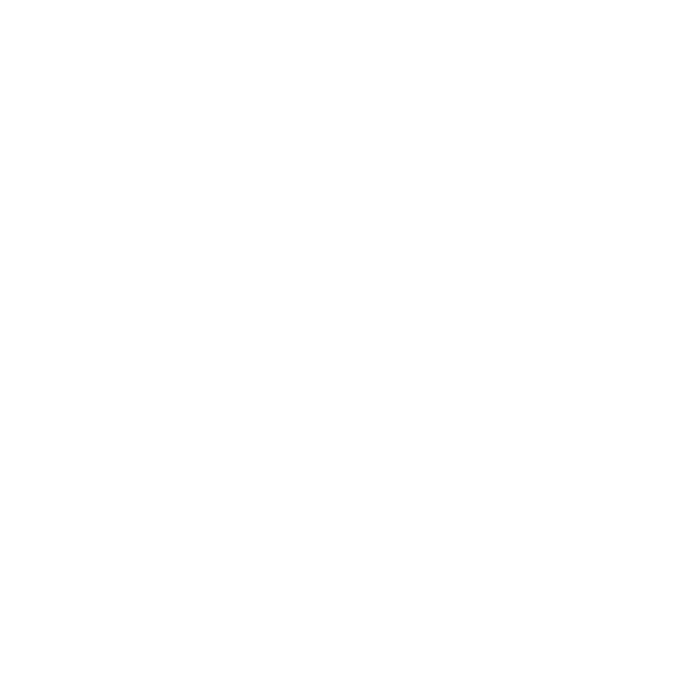
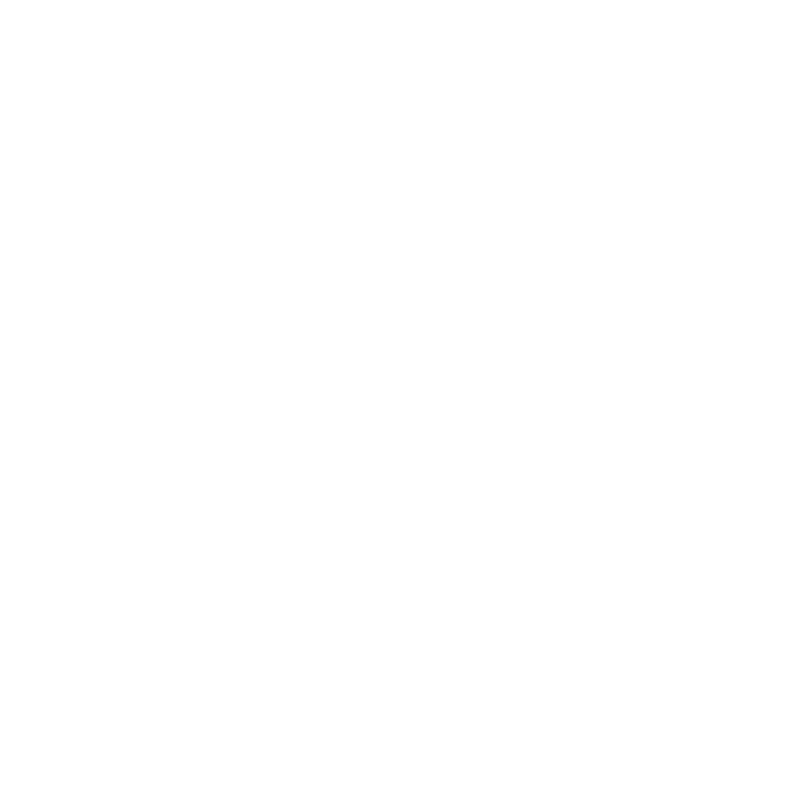
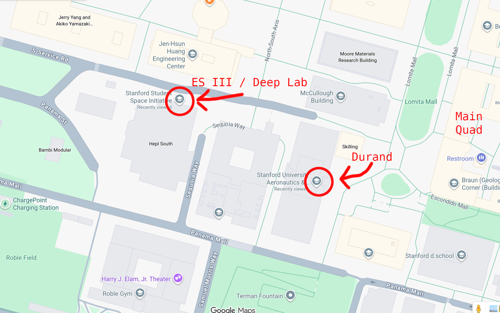

# Satellite-Avionics

Welcome to SSI **Satellite Avionics**! Here, you can find everything you need to navigate our team! This repository covers weekly meeting times, technical trainings, team design documentation, assembly processes, testing procedures, and so much more!

**If you're new to Satellite Avionics, (and of course, are a stanford student), you should look through the [Satellite Avionics Onboarding Document](https://docs.google.com/document/d/1Evk9vAAE3cXXHKh05v-SdmLuFbIsvqwTA4ssfbo16VE/edit?tab=t.0) to get started on our team!**

If you have any questions, feel free to contact any AV Co-lead on Slack! Or feel free to email Kale, the current AV co-lead repo manager at **kalesrz@stanford.edu**.

# Current Leadership (Spring 2026 - Winter 2027)
Satellite Avionics Co-Leads: 
 * Clara Zhen (czhen@stanford.edu)
 * Nimalan Anbhuarasan (nimalan@stanford.edu)
 * Kale Suarez (kalesrz@stanford.edu)

Satellite Co-Leads: 
 * Amy Zheng (amyzheng@stanford.edu)
 * River Dowdy (rivdowdy@stanford.edu)
 * Carson Lauer (clauer@stanford.edu)

Workspace Manager: Clara Zhen
 - Contact For Questions Regarding ES3 and Durand Access

## Getting On Slack!
In order to join our weekly meetings, you'll need to join our slack to figure out where were meeting! You can join our slack by clicking [here](https://ssi-teams.slack.com/signup). Once you're on the slack, go ahead and add the [#satellite-avionics](https://ssi-teams.slack.com/archives/C2L29KW8J) channel. You should also make sure to join all of these important channels!
* [#satellite-avionics](https://ssi-teams.slack.com/archives/C2L29KW8J)
    - All AV communication and announcements happen here! You need to be in this channel to know
      where were meeting for the week.
* [#satellites](https://ssi-teams.slack.com/archives/C04JL94F9)
    - General Satellites team communications and announcements happen here!
* [#satellite-systems](https://ssi-teams.slack.com/archives/C4UL92684)
    - System-wide meeting plans and discussions with other subteams on Satellites happen here!
* [#esiii](https://ssi-teams.slack.com/archives/C3YLQTN87)
    - Our Lab Space!!!
* [#doorbell](https://ssi-teams.slack.com/archives/CE360LHD0)
    - If you don't have keycard access to End Station III (ES3), run the `\doorbell` command to get someone to come open the door if anyones in ES3.

## Weekly Meeting Times
Satellite Avionics has two official meetings each week:

**Weekly Avionics Meeting**
 * **Time:** Thursday, 7:00 PM - 9:00 PM PST
 * **Location:** Check The [#Satellite-Avionics](https://ssi-teams.slack.com/archives/C2L29KW8J) channel in the slack for weekly meeting locations!
 * **Purpose:** Avionics meetings are specifically for AV-specific work, training, and discussions. AV member attendance is expected outside of conflicting Midterms or Finals. Fall quarter attendance is **mandatory** outside of class conflicts or personal health reasons.

**Satsurday Meetings**
 * **Time:** Saturday, 12:00 PM - 2:00 PM PST
 * **Location:** Check The [#Satellite-Avionics](https://ssi-teams.slack.com/archives/C2L29KW8J) channel in the slack for weekly meeting locations!
 * **Purpose**: Satsurday meetings are Satellite Avionics Full-Team work days! Every subteam will be meeting at this time. This can sometimes happen collectively and sometimes separately. Fall quarter will mostly be dedicated to AV specific onboarding training and early satellite development. Fall quarter attendance is **mandatory** outside of class conflicts or personal health reasons.

## Accessing Our Workspaces!
We primarily operate out of two buildings, End Station III (Deep Lab / Hepl South), and the Durand Aeronautics & Astronautics building. End Station III is a little difficult to find the first time, so please ask leads in the slack if you get lost!

### End Station III (Deep Lab / Hepl South)
**Address:** 491 S Service Rd, Stanford, CA 94305\
**Google Maps Link:** [Stanford Student Space Initiative](https://maps.app.goo.gl/ZUDnvgVmYYjSPFpS8)\
**Access Entrance:** Please enter through the **North Entrance** on Service Road (As Seen Below). After-Hours/Weekend Access requires that you obtain keycard access.

### Stanford University Aeronautics & Astronautics (Durand)
**Address:** 496 Lomita Mall, Stanford, CA 94305\
**Google Maps Link:** [Stanford University Aeronautics & Astronautics (Durand)](https://maps.app.goo.gl/TxbG7z5m1ypoC3tW7)\
**Access Entrance:** Any entrance can be used given you have obtained Durand keycard access. Otherwise, feel free to message a lead in the [#satellite-avionics](https://ssi-teams.slack.com/archives/C2L29KW8J) slack channel if you need help getting in!

### Gaining Access
To be able to gain keycard access to these workspaces and to be able to enter without another member to scan you in, you must complete the ES3 Lab safety trainings and complete all the steps listed on the [ES3 Access Guide](https://sites.google.com/stanford.edu/ssi/end-station-iii/keycard-access-for-es3). You will need to use your Stanford Email in order to view the guide.

## Additional Helpful Links / Quick Access
* [Stanford SSI Wiki: Satellites](https://ssi-wiki.stanford.edu/Category:Satellites)
    * SSI's official wiki page (notice: sometimes outdated, but there is some pretty useful information about the team and important definitions if you'd like to check it out.)\
* [SSI Slack Signup](https://ssi-teams.slack.com/signup)
* [ES3 Access Guide](https://sites.google.com/stanford.edu/ssi/end-station-iii/keycard-access-for-es3)
